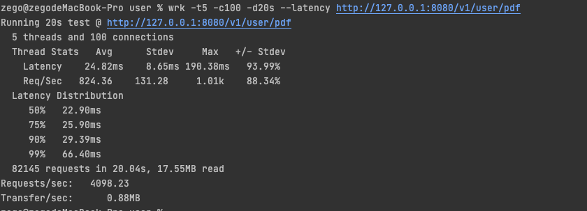
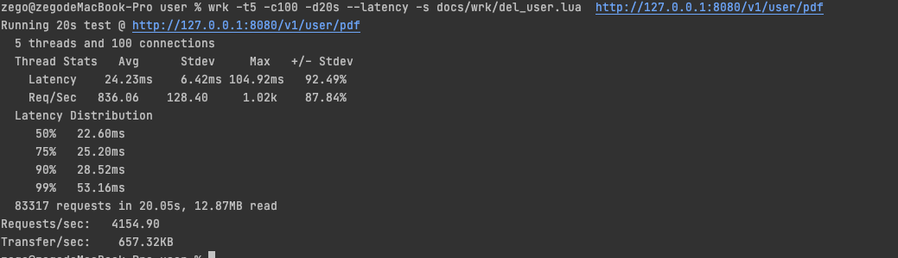
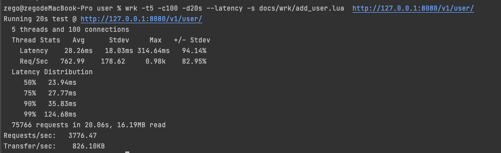
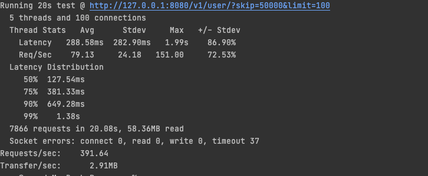

## Demo  项目

### 接口

1、 添加用户

```shell
curl --location --request POST 'localhost:8080/v1/user' \
--header 'Content-Type: application/json' \
--data-raw '{
    "nickName": "pdf13",
    "role": 1,
    "userId": "djxh"
}'
```

2、 删除用户

```shell
curl --location --request DELETE 'localhost:8080/v1/user/:userId'
```

3、 获取用户详情

```shell
curl --location --request GET 'localhost:8080/v1/user/:userId'
```

4、 获取用户列表

```shell
curl --location --request GET 'localhost:8080/v1/user?skip=10&limit=10011'
```

### Redis 存储说明

每个用户都以KV存储，用户信息使用JSON序列化为字符串，所以获取用户信息直接可以拿用户Id去获取。

同时，由于有列表需求，所以把用户Id放一个 ZSET 中，即方便 RANGE ，也方便删除


### 单元测试说明

启动单测应该先启动一个sidecar redis，并且设置环境变量 `GO_TEST_REDIS_URL` 为 sidecar redis的链接地址。

然后运行：

```shell
go test cmd/main_test.go
```

### 压测结果

Redis 使用公司虚拟机192.168.100.147部署的docker容器，版本5.0，项目跑在Mac本地。

1、获取用户信息接口
```shell
wrk -t5 -c100 -d20s --latency http://127.0.0.1:8080/v1/user/pdf
```


 
2、删除用户信息接口
```shell
wrk -t5 -c100 -d20s --latency -s docs/wrk/del_user.lua  http://127.0.0.1:8080/v1/user/pdf100
```



3、添加用户接口
```shell
wrk -t5 -c100 -d20s --latency -s docs/wrk/add_user.lua  http://127.0.0.1:8080/v1/user/
```



4、 获取用户列表

先用下面的代码生成了一些数据：
```go
package main

import (
	"fmt"
	"net/http"
	"strings"
)

func main() {
	for i := 0; i < 100000; i++ {
		res, err := http.Post(
			"http://localhost:8080/v1/user/",
			"application/json",
			strings.NewReader(fmt.Sprintf(`{"nickName":"pdf%v","Role":2,"userId":"pdf%v"}`, i, i)),
			)
		if err != nil {
			panic("错了")
		}
		res.Body.Close()
	}
	fmt.Println("结束")
}
```

```shell
wrk -t5 -c100 -d20s --latency "http://127.0.0.1:8080/v1/user/?skip=50000&limit=100"
```

